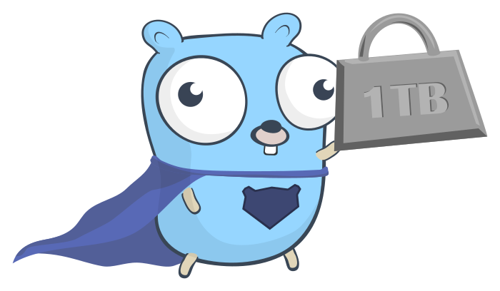

# 
<p align="center">
    
    <h2 align="center">Bulk Upload</h2>
</p> 
<h3 align="center">A simple guide to uploading data to the Server</h3>

<p align="center">Experiment in My Life (Part 1)</p>

## 😕 Why
Many application need uploading system. When the requirement only need to be able to upload 200 - 300 data, simply upload the data to the system without any special handling will not be a problem.

Problem rise when the requirement expands. When  the number of data need to be uploaded increase, there's a lot of problem that might appear, such as context deadline (default 60s on web) or invalid data that need to be checked. Not only that, dealing with partial error only on certain part of data thus requiring the operator/user to upload all the data again will take time. To deal with such problem, I am experimenting with partial upload with upload result, which give better user experience because we can see which data have beed processed and which haven't processed so the user only need to fix data that are invalid.

## ✨ What
A simple bulk upload system to handle alot of data. I use a fake whitelist/blacklist system uploading system to showcase the system. The operator can upload a bunch of user to be blocked / unblocked. After the operator uploaded it, the operator then can see a report for each row (data) to check either the upload is succesful or not...

## 🔨 WIP Features
- [ ] Scaling up System with Batching system & Goroutine 

## 🚀 Quick start
1. Clone the repository
```bash
git clone git@github.com:William9923/bulk-upload-poc.git
```
2. Setup the hooks
```bash
sh ./setup.sh
```
3. Import the Postman collection in `.api` folder

4. Run the Proof of Concept Code
```bash
make http
```
5. Feel free to try sending request using the Postman Collection

## ❌ Prerequisites
- Golang minimum v1.12 (https://golang.org/doc/install)
- Go Modules (https://blog.golang.org/using-go-modules)

## ✍️ Notes
This PoC do not use any kind of 3rd party service or any infrastructure. There are 3 reason why I don't like using standalone infrastructure when experimenting because:
1. It cost money
2. A lot harder to setup, especially for beginner like myself :D
3. I don't intend to maintain the PoC after finding the best way to implement a certain system :D.

Thus, I opt to use:
1. In Memory Database as the main datastore for the system
2. Local filesystem as the main file datastore for the system

Please don't judge me :D

## ⚠️ Disclaimer
This project use a really simple project structure that do not represent common big startup/company golang project structure. Please follow Golang guide for code modularization!

As a sidenote, I would like to give further notice first that the project structure does not represent common startup / big company project structure. It is very unlikely that a product only have a single usecase (in this project, only upload and export). When you have more complicated usecase that need to be modularized, please follow Golang guide for usecase & domain modularization

## 🥶 Misc
- [Requirement](docs/specs/requirements.md)
- [Activity Diagram](docs/specs/activity-diagram.md)

## ❤️ Support
If you feel that this repo have helped you provide more example on learning software engineering, then it is enough for me! Wanna contribute more? Please ⭐ this repo so other can see it too!
