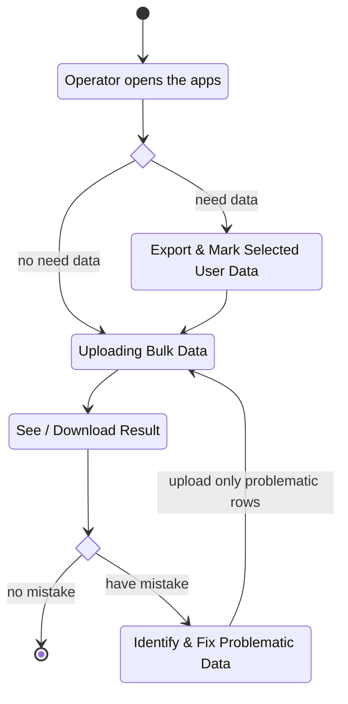

## Activity Diagram

```mermaid
stateDiagram
    A : Operator opens the apps
    B : Uploading Bulk Data
    C : See / Download Result
    D : Identify & Fix Problematic Data
    E : Export & Mark Selected User Data
    
    state need_data <<choice>> 
    state have_failed <<choice>>

    [*] --> A 
    A --> need_data
    need_data --> E : need data
    need_data --> B : no need data
    
    E --> B
    B --> C

    C --> have_failed
    have_failed --> [*] : no mistake
    have_failed --> D : have mistake
    D --> B : upload only problematic rows


```