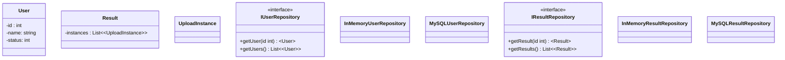

## Class Diagram

**Notes:**

User Status is defined with:
- 0 : Blacklist
- 1 : Whitelist / Active

Result Status is defined with:
- -1 : Not Processed
- 0 : Failed
- 1 : Success

Feel free to adjust the status based on your problem requirements...